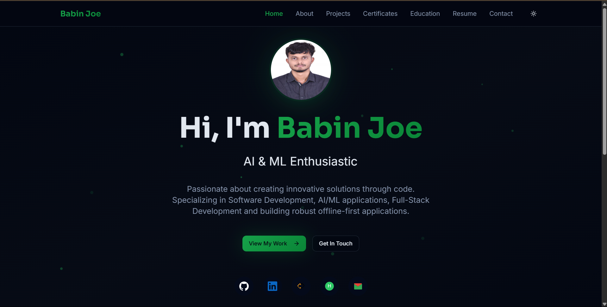

# 💼 Babin Joe's Developer Portfolio

This is a sleek and interactive developer portfolio built with **React**, **TypeScript**, **Tailwind CSS**, and **Vite**. It showcases Babin Joe’s summary, work, including projects, certificates, education, resume and contact details — along with a dark/light mode toggle and animated, responsive UI.



## 🔗 Live Site

➡️ [https://babin-joe.vercel.app/](https://babin-joe.vercel.app/)

---

## 🚀 Features

- 🌙 Dark/Light Mode Toggle  
- ⚡ Fast and optimized with Vite  
- 💬 Contact form powered by Vercel Serverless Function  
- 🧭 Smooth client-side routing via React Router  
- 🎨 Styled with Tailwind CSS + ShadCN UI  
- 📱 Fully Responsive across devices  
- 🔍 SEO-Friendly Structure  
- 🔄 Auto Scroll-to-Top on route change  
- 🧪 TypeScript for type safety  
- 📂 Organized code with modular components  
- 📜 Markdown-supported and clean README  

---

## 🛠️ Tech Stack

- **React**  
- **TypeScript**  
- **Tailwind CSS**  
- **ShadCN UI**  
- **Vite**  
- **React Router**  
- **Lucide Icons**  
- **Vercel (Hosting + API)**  

---

## 📁 Folder Structure

```
Portfolio/
├── public/
│   └── (favicons, og images, etc.)
├── src/
│   ├── assets/
│   ├── components/
│   │   ├── Navigation.tsx
│   │   ├── Footer.tsx
│   │   └── ScrollToTop.tsx
│   ├── pages/
│   │   ├── Home.tsx
│   │   ├── About.tsx
│   │   ├── Projects.tsx
│   │   ├── Certificates.tsx
│   │   ├── Education.tsx
│   │   ├── Resume.tsx
│   │   ├── Contact.tsx
│   │   └── NotFound.tsx
│   ├── components/ui/ (ShadCN UI components)
│   ├── App.tsx
│   └── main.tsx
├── api/
│   └── contact.js         # Contact form backend (Node.js)
├── vercel.json
├── package.json
├── tailwind.config.ts
├── tsconfig.json
```

---

## 📦 Installation & Development

1. **Clone the repository**

```bash
git clone https://github.com/BABIN-JOE/Portfolio.git
cd Portfolio
```

2. **Install dependencies**

```bash
npm install
```

3. **Start development server**

```bash
npm run dev
```

4. **Start backend (contact API) locally**

```bash
cd api
node contact.js
```

---

## 🧑‍💻 Deployment (Vercel)

The project is deployed using Vercel. It includes a [Serverless Function](https://vercel.com/docs/functions) (`api/contact.js`) to handle contact form submissions securely and efficiently.

To deploy manually:

```bash
vercel deploy
```

To run locally via Vercel:

```bash
vercel dev
```

---

## 📫 Contact Form Backend

The backend is a Vercel serverless function defined in `api/contact.js`. It uses **nodemailer** to send emails to your address when a user submits the contact form.

Make sure to set these environment variables in Vercel or in a `.env` file inside the `api/` directory:

```env
FROM_EMAIL=your_email@example.com
FROM_PASS=your_email_password
TO_EMAIL=recipient_email@example.com
```

> **Note:**  
> The environment variable names must match those above.  
> The `.env` file is already gitignored for security.

---

## 🎯 Improvements in Progress

- [x] Scroll-to-top on route change  
- [x] Contact form routing bug fixed  
- [x] Responsive mobile nav bar  
- [ ] Add animations using Framer Motion  
- [ ] Project filtering or tag system  
- [ ] Multilingual support  

---

## 🧠 Inspiration

This portfolio is custom-built to reflect Babin Joe’s personality, technical skillset, and UI/UX preferences — sleek, techy, with interactive glowing touches.

---

## 📜 License

This project is licensed under the **MIT License**. Feel free to fork and customize, but credit is appreciated.

---

## 🙌 Author

**Babin Joe**  
🔗 [Portfolio](https://babin-joe.vercel.app/) | [GitHub](https://github.com/BABIN-JOE) | [LinkedIn](https://www.linkedin.com/in/babin-joe/)

---

> Built with ❤️ by Babin Joe
